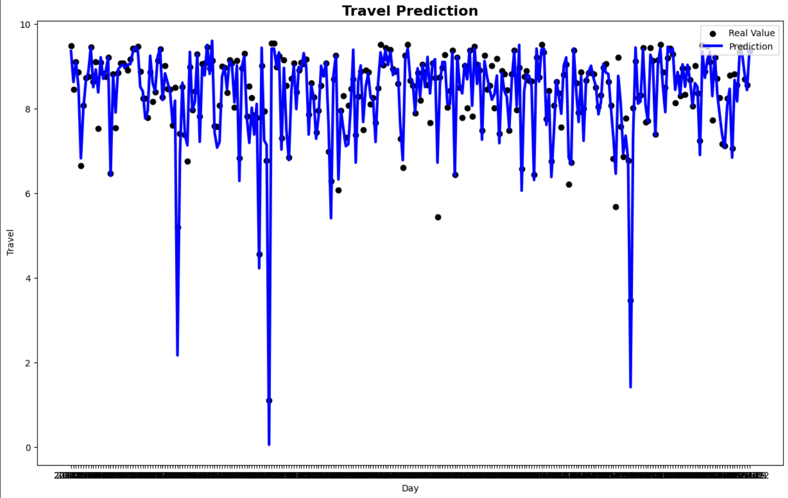

# Bicycle Demand Analysis and Forecasting

## Overview

This repository presents a comprehensive data science project focused on analyzing and forecasting bicycle demand. Using real-world data, the notebook in this project walks through exploratory data analysis (EDA), feature engineering, model building, evaluation, and interpretation to help understand the drivers of bicycle rentals and predict future demand.

---

## Features

- **Data Preprocessing**: Cleans and prepares the raw dataset, handling missing values and outliers.
- **Exploratory Data Analysis (EDA)**: Visualizes trends, seasonality, correlations, and influential factors affecting bicycle demand.
- **Feature Engineering**: Constructs new predictive features (e.g., extracting date parts, weather groupings) to improve model performance.
- **Model Building**: Compares multiple regression models such as Linear Regression, Lasso Regression, Ridge Regression, Support Vector Regression, Random Forest, etc. with with polynomial feature engineering and cross-validation
- **Hyperparameter Tuning**: Optimizes model parameters.
- **Forecast Visualization**: Plots predictions versus actuals to illustrate model accuracy and usability.
- **Model Interpretation**: Analyzes feature importance and provides actionable insights for business decision-making.

---

## Tech Stack

- **Languages**: Python
- **Data Analysis & Visualization**: Pandas, NumPy, Matplotlib, Seaborn
- **Modeling**: scikit-learn, XGBoost, statsmodels
- **Notebook**: Jupyter

---

## Sample Screenshots

- ### Exploratory Data Analysis ###

  *1) Number of trips in different months and at different temperatures*
  

  *2) Average Split of Number of Trips on a Workday across the day*
  

  *3) Average Split of Number of Trips on a Weekend or Holiday across the day*
  
     
  *4) Diversity Split of riders*
  

- ### Model Performance Visualization ###

  *1) Baseline Model* 
  

  *2) Best Model* 
  

---
